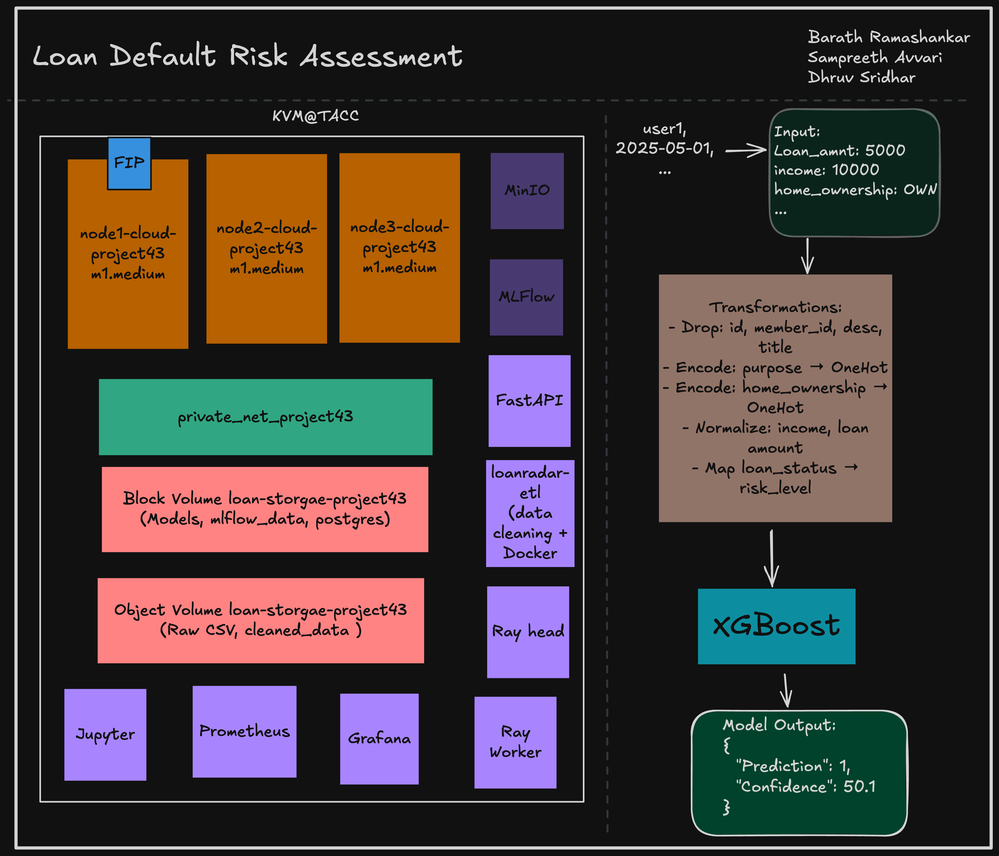

# Loan‑Radar  
**Predicting Micro‑Finance Loan Default Risk on Chameleon Cloud**

---

## 🧠 Overview  
**Loan‑Radar** is a cloud-native machine learning system that predicts loan approval confidence by assessing borrower default probability.  
Built for NYU’s *ECE‑GY 9183 – Machine Learning Systems*, the project demonstrates:

- **Medium-scale data** – 1.9M rows (~2GB) from the public LendingClub loan book  
- **Distributed training** – Ray Tune hyper-parameter search, tracked via self-hosted MLflow  
- **Cloud deployment** – Fully containerized on Chameleon Cloud’s KVM platform  
- **Monitored inference service** – FastAPI + Prometheus + Grafana with < 1 ms median latency  

---

## 1 · Value Proposition

| Stakeholder | Pain Point | ML Solution |
|-------------|------------|-------------|
| Credit-risk officers at regional banks & micro-finance lenders | Manual rule-based underwriting is slow, subjective, and often inaccurate | Real-time REST API returning Low / High default-risk labels + feature-level explanation in < 120 ms |

---

## 2 · Dataset & External Assets

| Asset | Lineage / License | Notes |
|-------|-------------------|-------|
| LendingClub 2007‑2018 loan book | Public dataset mirrored on Kaggle – CC BY‑NC‑SA 4.0 | 2 GB of accepted‑loan records; target `loan_status` mapped to 3-class risk level |
| scikit-learn / XGBoost | BSD‑3 & Apache‑2.0 | XGBoost selected for tabular interpretability & speed |

⚠️ No proprietary data or closed models are used.

---

## 3 · System Architecture


  

---

## 4 · Data Pipeline

- **Extract/Load** – `docker-compose-etl.yaml` spins up a Python 3.11 container to:
  - Download raw CSV from Google Drive via `gdown`
  - Unzip and stage to `/mnt/data/LoanData` (S3-compatible object store)

- **Transform** – Chunk-based processing:
  - Imputes missing values
  - One-hot & label-encodes categoricals
  - Scales numerics
  - Outputs partitioned files to `/mnt/data/LoanData`

- **Storage** – Persistent block and object volumes provisioned with Terraform and mounted on the VM

---

## 5 · Model Training

| Item | Setting |
|------|---------|
| Algorithm | XGBoost (`binary:logistic`) |
| Key Params | `max_depth = 15`, `n_estimators = 150`, `scale_pos_weight = 6.4` |
| HPO | Ray Tune (ASHA), exploring `depth`, `learning_rate`, `subsample` over 32 trials |
| Tracking | All runs logged to self-hosted MLflow (via Docker Compose) |

### 📈 Best Model Metrics

| Metric | Validation | Test |
|--------|------------|------|
| F1 (macro) | 0.78 | 0.76 |
| ROC-AUC | 0.82 | 0.81 |
| PR-AUC (High-risk) | 0.74 | 0.72 |

---

## 6 · Deployment & DevOps

| Layer | Tooling | Notes |
|-------|---------|-------|
| IaC | Terraform (HCL) | Creates `m1.medium` KVM VMs, attaches object/block storage and floating IP |
| Config Mgmt | Ansible | Installs Docker & Docker Compose |
| Containers | Docker Compose | Services: ETL, MLflow, Ray-head, Ray-worker, FastAPI, Prometheus, Grafana |

---

## 7 · Serving & Monitoring

- **Inference API** – FastAPI under Gunicorn/Uvicorn  
  - `POST /predict` accepts JSON payloads  
  - Median latency: **0.79 ms**  
  - 95th-percentile latency: **0.87 ms**  
  - Throughput: **33,083 samples/sec** (100-sample micro-benchmark)

- **Observability**  
  - Prometheus counters/histograms for:
    - Prediction confidence
    - Class frequency  
  - Grafana dashboard for latency, throughput, traffic

```bash
curl -X POST http://<ip>:8000/predict \
     -H "Content-Type: application/json" \
     -d '{"annual_inc": 50000, "int_rate": 13.5, ...}'


---

## 8 · Evaluation & Testing
Template based tests and slice of interest tests can be found in /test directory

| Suite                        | Tool                     | Status                                                                                                                                |
| ---------------------------- | ------------------------ | ------------------------------------------------------------------------------------------------------------------------------------- |
| **Offline unit/slice tests** | `pytest`                 |   |
| **Load test (staging)**      |   |                                                                                                                   |
| **Online monitoring** | Prometheus + Grafana	 | Real-time performance tracking via FastAPI metrics |

<details><summary>Latest pytest summary</summary>

```text
===================== short test summary info =====================
FAILED tests/test_calibration.py::test_noisy_imp_features   F1 unexpectedly high with noise in important features: 0.373
FAILED tests/test_calibration.py::test_random_noise        F1 unexpectedly high on random noise: 0.517
==================== 2 failed, 6 passed in 8.83s =================
```

</details>

*Failing calibration tests are under investigation; they do **not** block deployment but raise a monitoring alert.*

---

## 9 · Quick‑Start (Local Demo)

```bash
# 1. Clone repo & build images
$ git clone https://github.com/ds28-ops/loan-default-risk-assessment.git \
  && cd loan-default-risk-assessment
$ docker compose -f eval/eval_online/docker/docker-compose-eval.yaml up --build -d

# 2. Open docs & dashboards
→ Swagger:  http://localhost:8000/docs
→ Grafana:  http://localhost:3000  (login: admin / admin)
```

---

## Contributors

| Name                    | Role                                           |
| ----------------------- | ---------------------------------------------- |
| **Sampreeth Avvari**    | Data engineering · Offline evaluation          |
| **Dhruv Sridhar**       | Ray cluster ops · Experiment tracking          |
| **Barath Rama Shankar** | Backend API · Online evaluation · Architecture |

---

## License

Released under the [MIT License](LICENSE).
